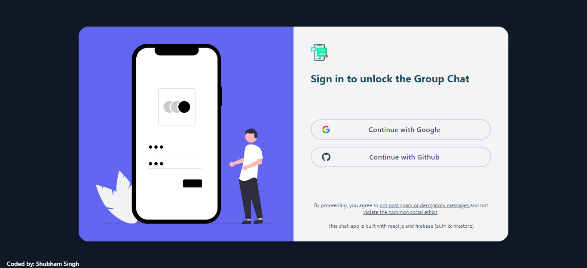
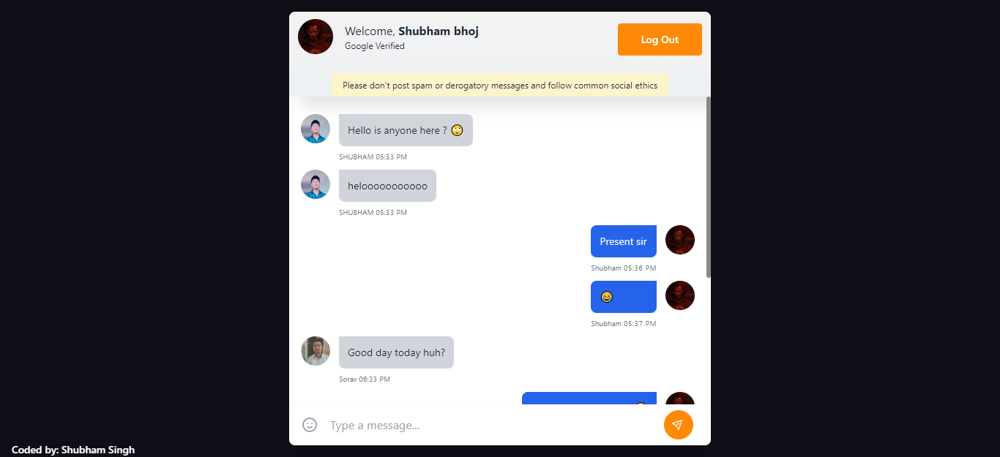
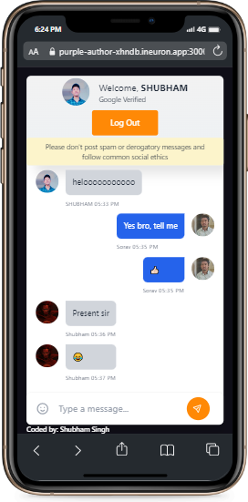

# Group Chat App with Firebase

## Description

A web-based communication platform built with 💻 React, 🔥 Firebase Firestore, 🔒 Google & Github authentication, and 🎨 Tailwind CSS along with 📦 Emoji Mart package.

Join chat groups, share messages in real-time 📩, and collaborate with others in a secure and user-friendly environment.

Fast and reliable message delivery and storage with Firebase Firestore. Convenient and secure sign up and login with Google & Github authentication.

Add a touch of personality to your chats with the Emoji Mart package. And, an interface that's both modern and visually appealing with Tailwind CSS.

Get ready to chat with ease and flair! 🚀

## Links for Project

- ### 📌 [LIVE Project Link](https://grp-chatapp.netlify.app/)

- ### 📌 [YouTube Link](https://youtu.be/PqgTkUEZ330)

## Tech Stack Used

## Key features:

- Group Chatting: Join chat groups to communicate with others in real-time.

- Reliable Message Delivery: Utilizing Firebase Firestore, messages are delivered and stored quickly and reliably.

- Secure Login: Users can sign up and log in to the app securely through Google and Github authentication.

- Emoji Support: Add a touch of personality to your chats with the Emoji Mart package.

- Modern Interface: The app features a modern and visually appealing interface designed with Tailwind CSS.

- Data Storage: Messages and data are stored securely on Firebase Firestore, ensuring their safety and accessibility.

- Cross-Platform Compatibility: The app is accessible from any device with an internet connection, making it easy to chat on the go.

## Project Screen Shot(s)

### Login page

### Chat page

### Mobile chat

## Checkout Portfolio & Other Projects

### ⭐ [Personal Portfolio](https://shubhambhoj.in)

## Connect with Me

- [Mailto](mailto:shubhambhoj3@gmail.com)

- [LinkedIn](https://www.linkedin.com/in/shubham-singh-b122b7171/)

---

[GO TO TOP](#group-chatapp-with-firebase)
